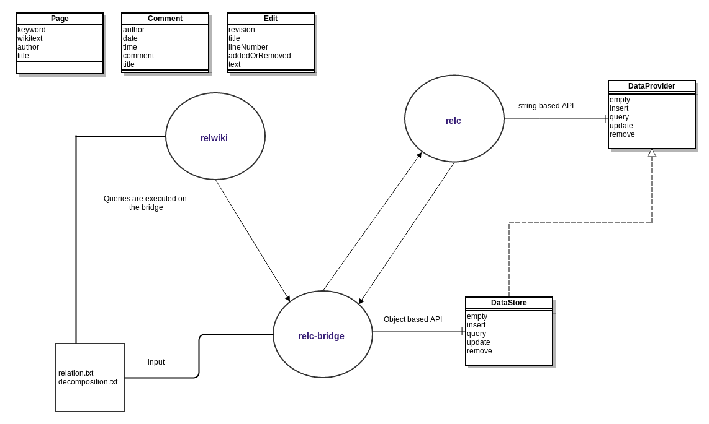

Data Synthesis Workshop
=======================

This repository is a result of the final project in "Data Synthesis Representation" course.

- Given at Tel-Aviv University in the fall semester of 2013
- Submission by Yevgeny Levanzov, Eli Polonsky and Daniel Samuelov

It consists out of 3 projects:

* 1. [relc](relc) - Compiles functional dependencies and decomposition graph into Java Code.
* 2. [relc-bridge](relc-bridge) - Compiles the output of the relc into bytecode and provides an object oriented API.
* 3. [relwiki](relwiki) - An example application using the relc-bridge.

