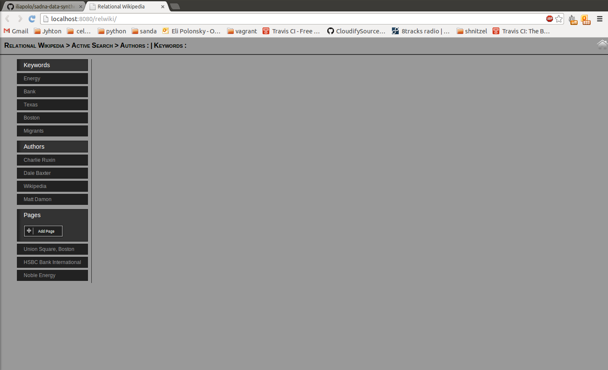
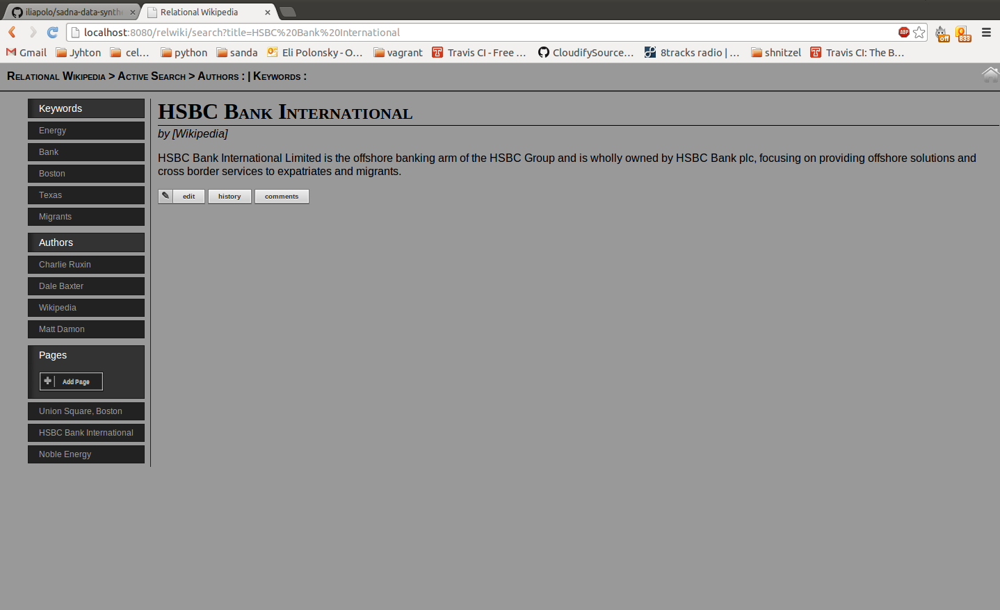

Relational Data Wikipedia
=========================

This project is a Spring MVC web application based on JSP for html rendering.

It uses the [relc-brige](../relc-bridge) for data operations.

Use the left menu to filter search results. you can filter by author and keyword until you hit the desired page.

Once you have selected a page, you can access its history, comments, and edit section.

